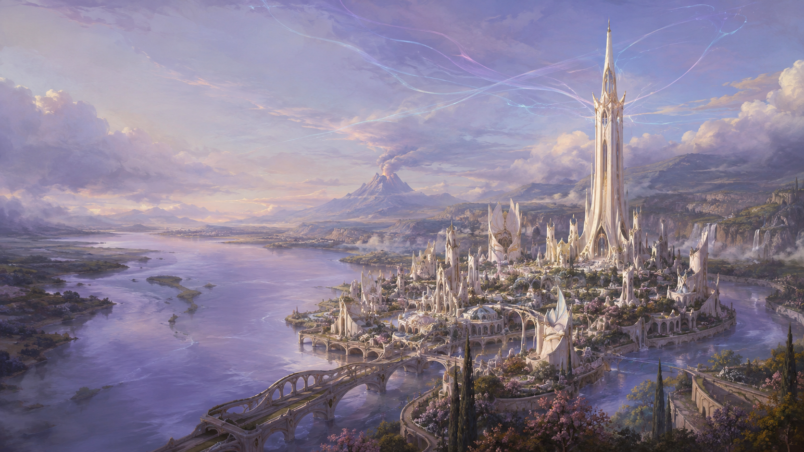
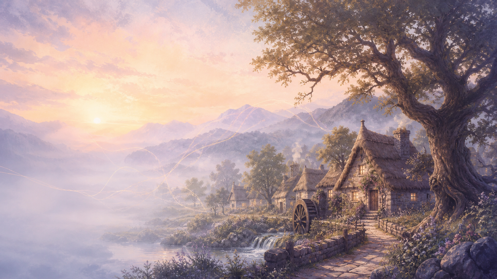
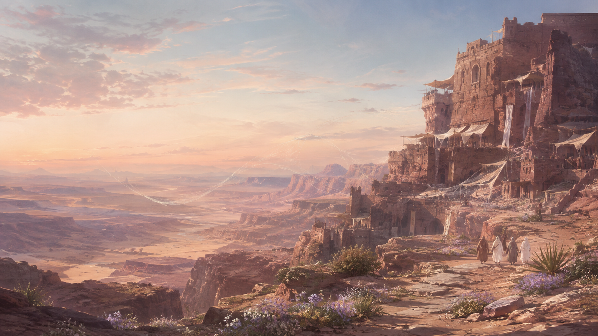
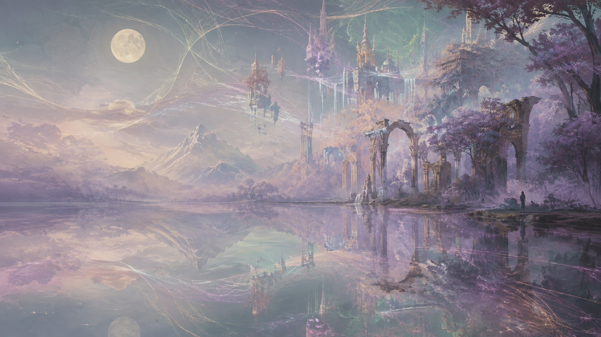
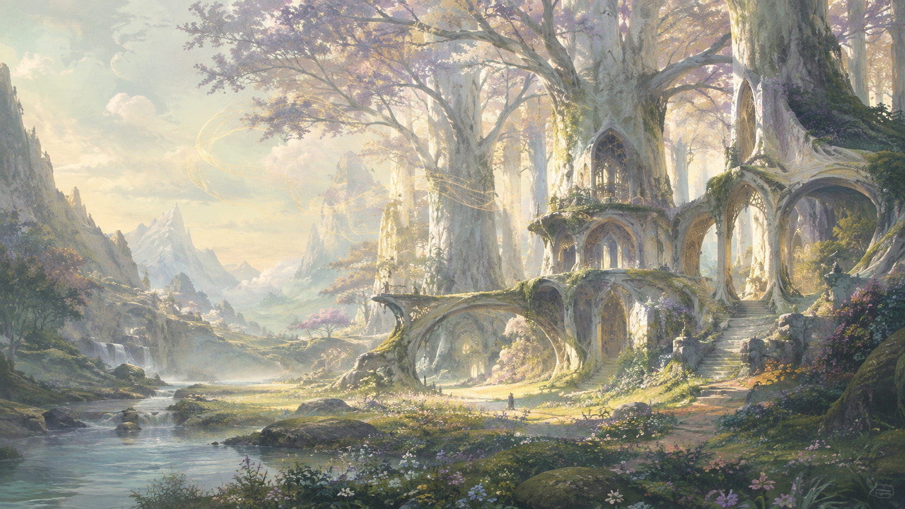
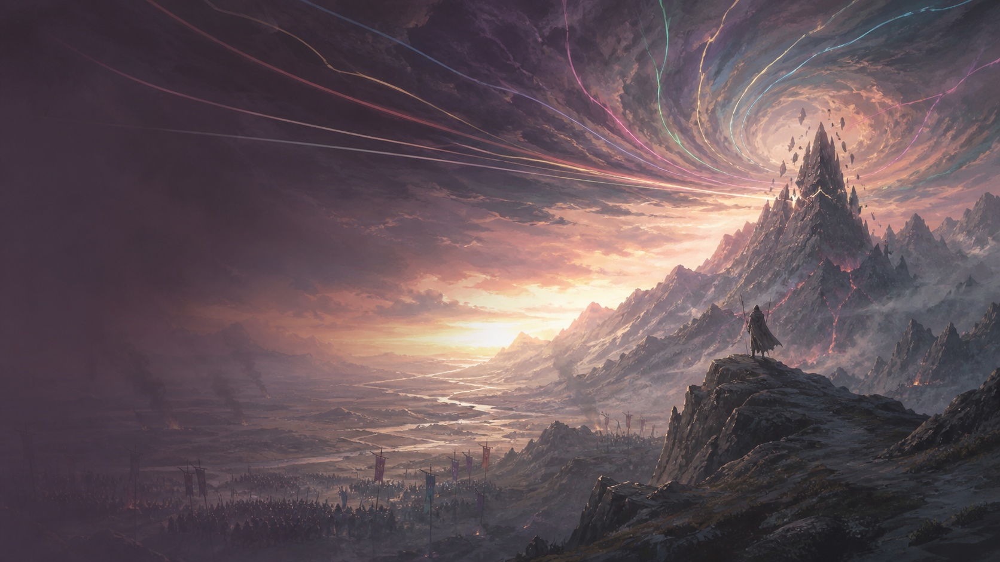

# Wheel of Time Glass

An Omarchy theme for Arch Linux and Hyprland inspired by the turning of the
Ages. It pairs smoky plum glass with muted teal, dusty rose, lavender, sage,
parchment, and soft gold.

The compact rounded surfaces and transparent terminal/bar treatment take
structural inspiration from
[Gruvy Glass](https://github.com/signaldirective/gruvy-glass), reworked into a
distinct pastel palette and current Omarchy shell theme.



## Installation

Install directly with Omarchy:

```sh
omarchy theme install https://github.com/mcsmith3/wheel-of-time-glass
```

Then select **Wheel of Time Glass** from the Omarchy theme menu, or run:

```sh
omarchy theme set wheel-of-time-glass
```

Cycle wallpapers with:

```sh
omarchy theme bg next
```

## What's included

- Modern Omarchy palette and translucent shell surfaces
- Hyprland glass settings: 91% active, 83% inactive, three-pass blur
- Ghostty preset with 34% background opacity and blur
- Walker launcher styling
- Gruvy-Glass-style compact Waybar layout and styling for legacy setups
- btop, Neovim, VS Code, and Vencord color extras
- Papirus Dark icon preference
- Six original 1672×941 wallpapers

## Transparency

This theme is intentionally a little clearer than Gruvy Glass:

| Surface | Opacity |
| --- | ---: |
| Ghostty background | 34% |
| Waybar glass | 34% |
| Omarchy bar | 72% |
| Launcher | 74% |
| Menus, popups, notifications | 78% |
| Active Hyprland windows | 91% |
| Inactive Hyprland windows | 83% |

Omarchy regenerates executable and terminal files when it installs a Git-backed
theme. The palette and shell styling install normally. On releases that filter
`ghostty.conf` or `hyprland.lua`, copy those files from this repository into a
hand-written local theme if you want the exact opacity values above.

## Recommended extras

- **GTK:** a muted dark GTK theme such as Colloid Dark or Graphite Dark
- **Icons:** Papirus Dark (referenced by `icons.theme`)
- **Font:** JetBrains Mono Nerd Font
- **Waybar:** the optional layout is in `waybar-theme/Wheel-of-Time-Glass/`
- **Discord:** import `vencord-theme.css` with Vencord or your CSS loader

## Wallpapers

| | |
| --- | --- |
|  |  |
|  |  |
|  |  |

The backgrounds are original AI-generated fan art. Robert Jordan's novels,
official Tor cover art, wider fan-art traditions, and the television series'
cinematic production design informed the broad locations and mood; no official
artwork, television stills, actor likenesses, or other source images are
redistributed or directly reproduced.

## Credits

- Theme and wallpaper direction: Matthew Smith
- Glass layout inspiration: [Signal Directive's Gruvy Glass](https://github.com/signaldirective/gruvy-glass)
- Original setting: Robert Jordan's *The Wheel of Time*, completed by Brandon Sanderson
- Wallpaper generation: OpenAI image generation

This unofficial fan theme is not affiliated with or endorsed by the Robert
Jordan estate, Harriet McDougal, Tor Books, Amazon MGM Studios, Sony Pictures
Television, Brandon Sanderson, or Omarchy.

## License

Theme configuration is released under the [MIT License](LICENSE). The license
does not grant rights to third-party names or fictional properties.
